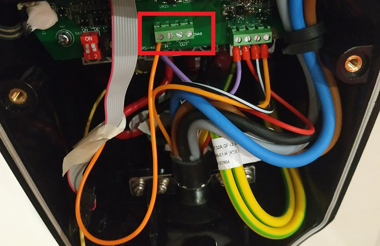

# Installation Guide

## Before You Begin

The following steps will involve opening your Tesla Wall Charger (TWC) chassis cover for the purpose of connecting RS-485 wires to a number of terminals on the TWC. These terminals are adjacent to live components within the Tesla Wall Charger, and the risk of electrocution if appropriate safety steps are not taken is **high**.

The installation does not require a great amount of electrical skill or competence, but it does involve serious voltages and currents, and for that reason, the guide will stress repeatedly the proper implementation of safety process throughout. The last thing I would want is for anyone to harm following this tutorial and for that reason I would stress that **if you are not confident that you understand the risks involved and could take the necessary steps throughout this process to protect yourself from electrocution, please do not attempt this, please ask your electrician for assistance**.

  * If you are not confident or comfortable with the modification of the TWC installation, please stop here.
  * If you do not have access to a (or several) isolation devices to entirely de-energise the TWC during the installation, please stop here.

## Basic Installation

The basic installation approach consists of a pair of wires being installed into the RS-485 sockets of the Tesla Wall Charger, with an external device providing an RS-485 interface on which TWCManager communicates with

Pros
  * Simpler installation, only requires feeding some wires through an existing entry point into the TWC.

Cons
  * There is some visible external egress of these wires to connect to the controlling device.

### RS-485 Connection

Once you have removed the Tesla Wall Charger cover, you should see a set of 4 headers for RS-485 communication, in the centre of the unit. The header is highlighted in the following picture. Note that in the picture, one of the two RS-485 wires has already been attached.

You may connect your RS-485 wires to either the In or the Out (but not both) header pins. To do this, you'll need a 3mm flat-head screwdriver. Strip approximately 3mm of insulation from the wires that you will be connecting, and feed them from the bottom of the RS-485 headers into the positive or negative terminals for either the In or Out headers.

## Expert Installation

The Expert Installation approach is not recommended for most users due to the inherent difficulty of the installation process, and the inherent risk of inadvertent contact with a live component within the TWC chassis.
